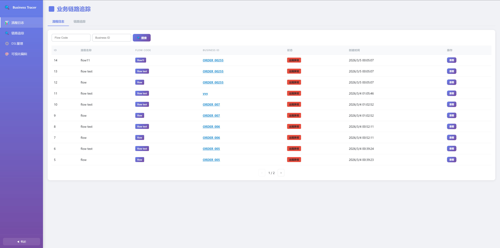
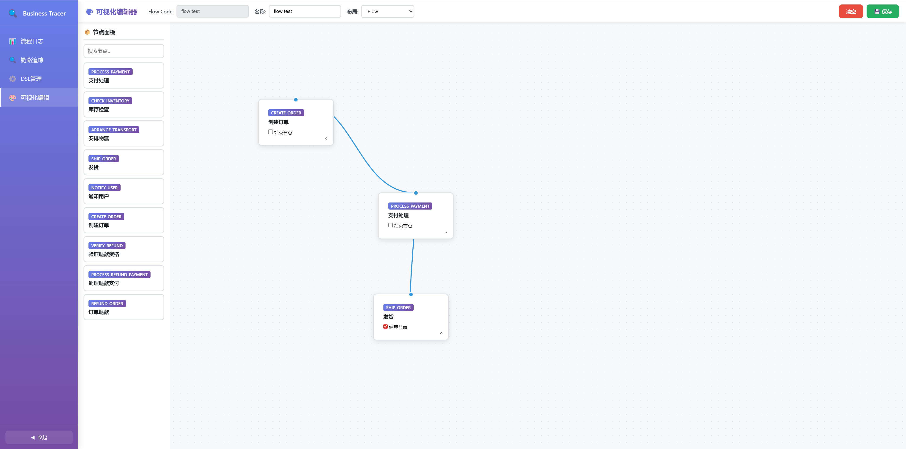
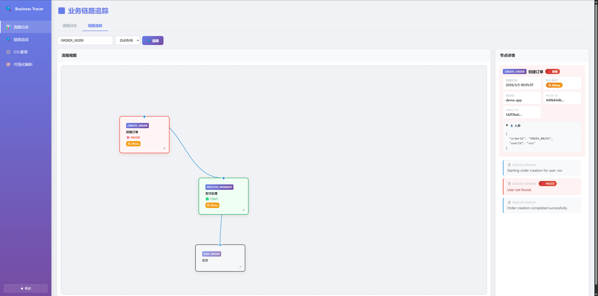

<div align="center">

   

<h3>Business Tracer Spring Boot Starter</h3>

English | <a href="README_zh.md">中文</a>

</div>

---

Business Tracer is a lightweight distributed business link tracing component based on Spring Boot. It allows developers to trace the complete lifecycle of a business object (like an Order) across multiple services and disparate technical traces by using a unified **Business ID**.

Unlike traditional APM (TraceId-based), Business Tracer aggregates logs based on **Business Identity**, solving the problem of fragmented logs in long-running business processes (e.g., Order Create -> Pay -> Ship).

## Features

- **Business ID Centric**: Aggregates logs by Business ID (e.g., Order No) across different requests and services.
- **Node & Detail Tracking**:
    - **Node**: High-level step defined by `@BusinessTrace` on methods. Tracks execution time (`cost_time`), input/output parameters via SpEL, and exceptions.
    - **Detail**: Fine-grained steps or errors recorded via `BusinessTracer.record()` and `BusinessTracer.recordError()` inside nodes.
- **Visual Trace UI & DSL Editor**: Built-in Drawflow-based UI integration for designing business flows (DSL) and viewing execution traces in real-time. Nodes display elapsed time, parameters, exceptions, and color-coded statuses (e.g., green for success, red for failures).
- **Advanced Error Handling**: Captures method exceptions automatically. Can also programmatically trigger node/flow failures using `BusinessTracer.recordError()`.
- **Distributed Propagation**: Automatically propagates Business ID and context via HTTP headers (`X-Business-Id`) between microservices.
- **MDC Integration**: Automatically injects `businessId` and `traceId` into SLF4J MDC for correlation with standard logs.
- **Domain-Driven Design (DDD)**: Architected utilizing DDD principles for easier maintenance and testing boundaries. Excellent support for Spock + H2 unit testing.

## Quick Start

### 1. Requirements

- Java 8+
- Spring Boot 2.x
- MySQL Database

### 2. Dependency

Add the dependency to your project's `pom.xml`:

```xml
<dependency>
    <groupId>com.bananice</groupId>
    <artifactId>business-tracer-spring-boot-starter</artifactId>
    <version>1.0.0-SNAPSHOT</version>
</dependency>
```

Need to install the starter to your local Maven repository:

```bash
mvn clean install
```

### 3. Database Setup

Execute the initialization script (`sql/init.sql`) to create the necessary tables:
- `business_flow_dsl`: Stores flow definition DSLs (JSON).
- `business_flow_log`: Top level flow tracking logs.
- `business_trace_node`: Tracks each step (node) in the flow, including parameters, execution time, exceptions, and status.
- `business_trace_detail`: Tracks internal node details and errors.
- `business_alert_rule`: Alert rules by scope (`GLOBAL`/`FLOW`/`NODE`).
- `business_alert_channel`: Alert delivery channels (WEBHOOK/WECOM/DINGTALK/EMAIL).
- `business_alert_event`: Alert events produced by runtime evaluation.
- `business_alert_dispatch_log`: Per-channel dispatch attempts for each event.
- `business_alert_config_version`: Version marker for alert config cache sync.

### 4. Configuration

Configure your database connection in `application.yml` or `application.properties`:

```yaml
spring:
  datasource:
    url: jdbc:mysql://localhost:3306/your_db?useSSL=false
    username: root
    password: password
    driver-class-name: com.mysql.cj.jdbc.Driver
  application:
    name: your-service-name

business-tracer:
  alert:
    # runtime thresholds
    slow-node-threshold-ms: 2000
    flow-stuck-threshold-ms: 300000

    # scheduler switches and intervals
    scheduling-enabled: true
    config-sync-fixed-delay-ms: 5000
    flow-stuck-scan-fixed-delay-ms: 60000
    aggregation-flush-fixed-delay-ms: 60000
    history-cleanup-fixed-delay-ms: 3600000

    # retention and dispatch behavior
    retention-days: 30
    dispatch-attempt-timeout-ms: 1000
    dispatch-max-retries: 1
```

## Usage

### 1. Annotation Mode (Defining Nodes)

Use `@BusinessTrace` on your service methods to define a "Node" in the business flow. Use SpEL to extract the Business ID, as well as input/output parameters dynamically.

```java
import com.bananice.businesstracer.api.BusinessTrace;

@Service
public class OrderService {

    @BusinessTrace(
        code = "CREATE_ORDER", // Unique identifier for the node, used to define the flow in DSL
        name = "Create Order", // Human-readable name
        key = "#order.orderId", // Business ID (SpEL)
        operation = "Create a new order", // Description of the operation
        inputParams = "#order",
        outputParams = "#result"
    )
    public OrderResult createOrder(Order order) {
        // Business logic...
        return new OrderResult(true);
    }
}
```
If an unhandled exception occurs in a `@BusinessTrace` method, the node and its parent flow are automatically marked as `FAILED`, and the stack trace is recorded. The execution time (`cost_time`) is automatically tracked.

### 2. Programmatic Mode (Recording Details & Errors)

Inside a traced method (Node), use `BusinessTracer` to add detailed logs or explicitly record errors that should mark the node as failed without throwing an exception.

```java
import com.bananice.businesstracer.api.BusinessTracer;

@Service
public class OrderService {

    @BusinessTrace(code = "PAY", key = "#orderId", name = "Process Payment")
    public void pay(String orderId) {
        BusinessTracer.record("Payment validation successful");
        
        if (paymentFails()) {
            // Records a detail log with status=FAILED and marks the whole node and flow as FAILED
            BusinessTracer.recordError("Gateway timeout");
        }
    }
}
```

### 3. Visual Trace UI

The component provides a built-in web interface for visualizing business flows and execution traces. Once your application is started, you can access the UI at:

**`http://localhost:8080/business-tracer/index.html`**



- **DSL Management**: Create and edit business flow definitions using a visual graph editor.



- **Trace Visualization**: View the execution path of a specific `businessId`, including node status (Success/Failure), execution time, and detailed logs.



- **API Endpoints**: The UI communicates via endpoints like `/business-tracer/api/flow-logs` and `/business-tracer/trace?businessId=...`.

### 4. Alert Center (Rules / Channels / Silence / History)

Business Tracer includes an Alert Center UI for operational monitoring and alert management.

Access URL:

**`http://localhost:8080/business-tracer/alerts.html`**

Main tabs:
- **Rules**: configure scoped alert rules with precedence `NODE(flow+node) > FLOW(flow) > GLOBAL`.
- **Channels**: manage channel definitions and trigger channel test-send.
- **Silence**: maintain silence window config (browser local storage in current implementation).
- **History**: query alert events by type/status/time and inspect dispatch logs.

Core APIs used by the Alert Center:
- `GET /business-tracer/api/alerts/rules`
- `PUT /business-tracer/api/alerts/rules/{scopeType}/{scopeCode}`
- `GET /business-tracer/api/alerts/channels`
- `POST /business-tracer/api/alerts/channels`
- `PUT /business-tracer/api/alerts/channels/{id}`
- `POST /business-tracer/api/alerts/channels/{id}/test-send`
- `GET /business-tracer/api/alerts/events`
- `GET /business-tracer/api/alerts/events/{id}/dispatch-logs`

### 5. Distributed Tracing

When making HTTP calls to downstream services, the component automatically handles context propagation via standard mechanisms.

The following headers are propagated:
- `X-Business-Id`
- `X-Trace-Id`
- `X-Parent-Node-Id`

Ensure downstream services also include this starter to link their logs together.

### 5. Asynchronous Context Propagation

Business Tracer provides built-in support for propagating the trace context across asynchronous boundaries (e.g., child threads, `@Async` methods, or thread pools).

**1. Simple Child Threads:**
Because the internal context holder uses `InheritableThreadLocal`, any simple `new Thread()` spawned from an active business trace will automatically inherit the `TraceContext`.

**2. Thread Pools & `@Async`:**
When using thread pools, the thread reuse prevents natural inheritance. To ensure context propagates to pooled threads (and standard Spring `@Async` methods), configure your `ThreadPoolTaskExecutor` to use `TraceContextTaskDecorator`:

```java
import com.bananice.businesstracer.infrastructure.context.TraceContextTaskDecorator;
import org.springframework.context.annotation.Bean;
import org.springframework.context.annotation.Configuration;
import org.springframework.scheduling.concurrent.ThreadPoolTaskExecutor;

@Configuration
public class ExecutorConfig {

    @Bean("myTaskExecutor")
    public ThreadPoolTaskExecutor myTaskExecutor() {
        ThreadPoolTaskExecutor executor = new ThreadPoolTaskExecutor();
        executor.setCorePoolSize(5);
        // ... other configurations ...
        // IMPORTANT: Add the TaskDecorator to propagate TraceContext
        executor.setTaskDecorator(new TraceContextTaskDecorator());
        executor.initialize();
        return executor;
    }
}
```

Now, any asynchronous method running inside `myTaskExecutor` will seamlessly inherit the parent thread's `Business ID`. This enables `BusinessTracer.record()`, `BusinessTracer.recordError()`, and standard SLF4J MDC usage to function seamlessly within asynchronous tasks.

## Architecture

The project is structured following **Domain-Driven Design (DDD)** principles:

- **API**: Public annotations (`@BusinessTrace`) and static helpers (`BusinessTracer`).
- **Application**: Application services (`DslService`, `FlowLogService`, etc).
- **Domain**: Core entities (`NodeLog`, `DetailLog`, `FlowLog`, `DslConfig`), and repositories.
- **Infrastructure**: Implementation of persistence, MVC Controllers (Presentation), Context (ThreadLocal/MDC), and AOP Interceptors inside Spring Boot auto-configuration.
- **Tests**: Exhaustive test suite utilizing **Spock Framework** along with H2 in-memory databases.

## License

MIT
